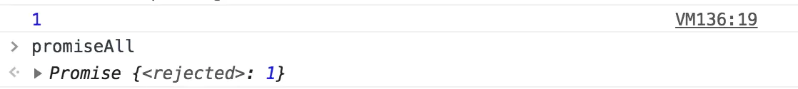

# 理解异步之美：Promise与async await（一）
你可能会放出一个怪物
异步与同步相比，最难以掌控的就是异步的任务会什么时候完成和完成之后的回调问题，
难以掌控的触发状态，让你自己写的代码当时还可以读懂，但是过几天、半个月之后如果不重新盘一边逻辑，你哪知道哪个内容会先执行，借用这么一个例子
```js
listen( "click", function handler(evt){
	setTimeout( function request(){
		ajax( "http://some.url.1", function response(text){
			if (text == "hello") {
				handler();
			}
			else if (text == "world") {
				request();
			}
		} );
	}, 500) ;
} );

doSomething();
```
很难以理解这种地狱式的回调（回调地狱）会对可读性有多么大的摧毁。
首先 执行listern() 

其次 doSomething()

500ms（或者更远）后执行ajax()

ajax完成后  

如果text === hello 执行handler()

如果text === world 执行request()  

难受吗？？？

在你不知道的javascript一书中，对于回调的信任问题做了阐述
当你使用第三方的库的方法处理回调时很有可能遇到以下信任内容：

怎么解决？？？？ 这种信任问题该怎么办？

## 事实证明 你需要一个承诺
当你把一件事情交给别人去做（可能马上就能完成的也可能是需要一段时间的）这个人在任务完成或者失败后都会给你一个回应，这样的人你是不是特别放心的把事情交给他，他没回应你那么他是正在办事、回应你了就是成功了或者失败了。

### 在javascript中这样的人就是Promise。
Promise的实例有三个状态，Pending（进行中）、Resolved（已完成）、Rejected（已拒绝）。当你把一件事情交给promise时，它的状态就是Pending，任务完成了状态就变成了Resolved、没有完成失败了就变成了Rejected。

言归正传：写一个简单的promise
```js
let promise = new Promise((resolve,reject)=>{
    // 接收一个callback。参数是成功函数与失败函数
	setTimeout(()=>{
       let num = parseInt(Math.random()*100);
       // 如果数字大于50就调用成功的函数，并且将状态变成Resolved
       if(num > 50){
          resolve(num);
       }else{
        // 否则就调用失败的函数，将状态变成Rejected
          reject(num)
       }
	},10000)
})
```
当Promise执行的内容符合你预期的成功条件的话，就调用resolve函数，失败就调用reject函数，这两个函数的参数会被promise捕捉到。可以在之后的回调中使用。

创建一个承诺我们已经做完了，那么如何使用承诺后的结果呢？
```js
promise.then(res=>{
    console.log(res);
    //在构造函数中如果你执行力resolve函数就会到这一步
},err=>{
    // 执行了reject函数会到这一步
    console.log(err);
})
```
then方法接收两个函数，第一个是承诺成功（状态为resolved）的回调函数，一个承诺失败（状态为rejected）的回调函数。

then方法的返回值不是一个promise对象就会被包装成一个promise对象，所以then方法支持链式调用。
```js
promise.then(res=>{ return 42}).then(res=>{console.log(res)})
// 打印出42
```
then方法的链式调用可以帮我们串行的解决一些逻辑，当我们平时书写有顺序的异步时间，比如
```js
ajax('first');
ajax('second');
ajax('third');
需要按顺序来执行怎么办？
ajax('first').success(function(res){
    ajax('second').success(function(res){
        ajax('third').success(function(res){
            //串行完毕可以执行你想要的内容了
        });
    })
})
多么美丽而又让人望而却步的三角形啊！！
```
如果使用then的链式调用呢？
```js
let promise = new Promise((resolve,reject)=>{
    ajax('first').success(function(res){
        resolve(res);
    })
})
promise.then(res=>{
    return new Promise((resovle,reject)=>{
        ajax('second').success(function(res){
            resolve(res)
        })
    })
}).then(res=>{
    return new Promise((resovle,reject)=>{
        ajax('second').success(function(res){
            resolve(res)
        })
    })
}).then(res=>{
    // 串行完毕你要做的xxx可以开始了
})
```
而且每次执行resolve的时候，都可以把每次ajax的回调数据进行传递到最后。清晰简单明了。

说完串行了，那么并行怎么办？？？

当有多个异步事件，之间并无联系而且没有先后顺序，只需要全部完成就可以开始工作了。

串行会把每一个异步事件的等待时间进行一个相加，明显会对完成进行一个阻塞。那么并行的话该怎么确定全部完成呢？
## Promise.all 与 Promise.race的妙用
Promise.all 接收一个数组，数组的每一项都是一个promise对象。当数组中所有的promise的状态都达到resolved的时候，Promise.all的状态就会变成resolved，如果有一个状态变成了rejected，那么Promise.all的状态就会变成rejected（任意一个失败就算是失败），这就可以解决我们并行的问题。调用then方法时的结果成功的时候是回调函数的参数也是一个数组，按顺序保存着每一个promise对象resolve执行时的值。
```js
let promise1 = new Promise((resolve,reject)=>{
	setTimeout(()=>{
       resolve(1);
	},10000)
});
let promise2 = new Promise((resolve,reject)=>{
	setTimeout(()=>{
       resolve(2);
	},9000)
});
let promise3 = new Promise((resolve,reject)=>{
	setTimeout(()=>{
       resolve(3);
	},11000)
});
Promise.all([promise1,promise2,promise3]).then(res=>{
    console.log(res);
    //[1,2,3] 证明与哪个promise的状态先变成resolved无关
})

let promise1 = new Promise((resolve,reject)=>{
	setTimeout(()=>{
       reject(1);
	},10000)
});
let promise2 = new Promise((resolve,reject)=>{
	setTimeout(()=>{
       resolve(2);
	},9000)
});
let promise3 = new Promise((resolve,reject)=>{
	setTimeout(()=>{
       resolve(3);
	},11000)
});
let promiseAll =Promise.all([promise1,promise2,promise3]);
promiseAll.then(res=>{
    console.log(res);
},err=>{
    console.log(err)
})
```

看结果不难看出来符合之前所说的

Promise.race 竞速模式 也是接受一个每一项都是promise的数组。但是与all不同的是，第一个promise对象状态变成resolved时自身的状态变成了resolved，第一个promise变成rejected自身状态就会变成rejected。第一个变成resolved的promsie的值就会被使用。
```js
let promise1 = new Promise((resolve,reject)=>{
	setTimeout(()=>{
       reject(1);
	},10000)
});
let promise2 = new Promise((resolve,reject)=>{
	setTimeout(()=>{
       resolve(2);
	},9000)
});
let promise3 = new Promise((resolve,reject)=>{
	setTimeout(()=>{
       resolve(3);
	},11000)
});
Promise.race([promise1,promise2,promise3]).then(res=>{
	console.log(res);
	//打印出2 为什么不打印出1呢？因为promise2先完成了其余的就忽略来
},rej=>{
    console.log('rejected');
    console.log(rej)};
)
// 大家可以尝试自己改变时间进行测试
```
Promsie.race还有一个很重要的实际用处就是，有时候我们要去做一件事，但是超过三秒钟左右我们就不做了那怎么办？

这个时候可以使用Promise.race方法
```js
Promise.race([promise1,timeOutPromise(3000)]).then(res=>{})
// timeOutPromise延时3s左右 由于是用setTimeout来实现的并不一定准确3s（一般主线程在开发中不会阻塞3s以上的所以不会有太大问题）
```

