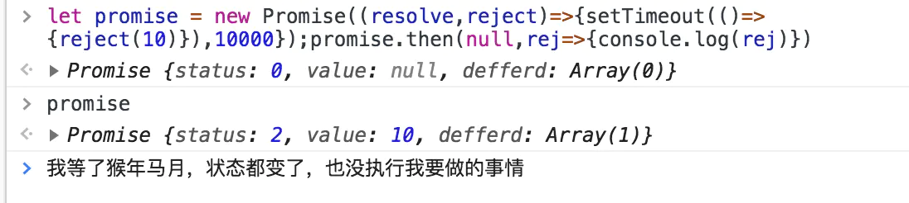

# 理解异步之美：Promise 与 async await（二）
## 承上启下
经历了上一篇基础的Promise讲解后我觉得大家对于promise的基本用法和想法就有一定了解了。（就是一种承诺哟）

下面我们要去了解一下它的工作流程
### 下面是别人实现的总源码，（简单一看就可以）
```js
var PENDING = 0;
var FULFILLED = 1;
var REJECTED = 2;
function Promise(callback) {
    this.status = PENDING;
    this.value = null;
    this.defferd = [];
    setTimeout(callback.bind(this, this.resolve.bind(this), this.reject.bind(this)), 0);
}
    Promise.prototype = {
        constructor: Promise,
        resolve: function (result) {
            this.status = FULFILLED;
            this.value = result;
            this.done();
        },
        reject: function (error) {
            this.status = REJECTED;
            this.value = error;
        },
        handle: function (fn) {
            if (!fn) {
                return;
            }
            var value = this.value;
            var t = this.status;
            var p;
            if (t == PENDING) {
                this.defferd.push(fn);
            } else {
                if (t == FULFILLED && typeof fn.onfulfiled == 'function') {
                    p = fn.onfulfiled(value);
                }
                if (t == REJECTED && typeof fn.onrejected == 'function') {
                    p = fn.onrejected(value);
                }
                var promise = fn.promise;
                if (promise) {
                    if (p && p.constructor == Promise) {
                        p.defferd = promise.defferd;
                    } else {
                        p = this;
                        p.defferd = promise.defferd;
                        this.done();
                    }
                }
            }
        },
        done: function () {
            var status = this.status;
            if (status == PENDING) {
                return;
            }
            var defferd = this.defferd;
            for (var i = 0; i < defferd.length; i++) {
                this.handle(defferd[i]);
            }
        },
        then: function (success, fail) {
            var o = {
                onfulfiled: success,
                onrejected: fail
            };
        var status = this.status;
        o.promise = new this.constructor(function () {});
        if (status == PENDING) {
            this.defferd.push(o);
        } else if (status == FULFILLED || status == REJECTED) {
            this.handle(o);
        }
        return o.promise;
        }
    };
```
这是网上一份常见的Promise的源码实现我会对这个进行一个分析
（肯定有人问为什么不自己实现一个？ 解：省时、网上太多了、本质还是要了解思想）

### 话不多说开始咯
**咱们先大体梳理一下实现的东西要能干什么？**

first ：
```js
let promsie = new Promise((resolve,reject)=>{
    doSomething()
})
根据这个构造函数，我们需要实现两个方法，resolve、reject方法。
复制代码second :
promise.then(res=>{
    doSomethingRes();
},rej=>{
    doSomenthingRej()
})
我们要实现一个then方法，可以去根据不同状态来执行不同的函数。
```
最基本的两个内容我们已经确定了。

话不多说开始分析代码。

>**对代码的分析在内容的注释上大家不要遗漏哈！！！**

## 第一段 构造函数与状态设定
```js
// 首先声明三个状态，
// 状态的就是上一节说的：事情是进行中、已完成、失败了。
// 这三种状态遵循着PENDING->FULEFILLED 或者PENDING->REJECTED
var PENDING = 0;
var FULFILLED = 1;
var REJECTED = 2;
// Promise构造函数接收u一个回调函数
function Promise(callback) {
    // 新new出来的实例的status一定是PENDING.
    this.status = PENDING;
    // value是指当你事情完成、失败后内部保存的值
    // 用法是resolve（42） 在then函数的res=>{dosomething（）res就是42
    }
    this.value = null;
    // defferd 字面意思推迟、是个数组，存放这个promise以后要执行的事件
    // 类比发布订阅模式（观察者模式）。存放观察者在被观察者身上订阅的事件列表
    // defferd内的事件存放着日后观察者要执行的事件。
    this.defferd = [];
    // setTimeout异步的去执行new 一个promise实例内执行的任务，不去阻塞主线程。
    //这一段代码我有一点疑惑,new promise实例时，callback的执行并不是异步的。
    // 而这里选择异步的并不是很合理。
    // bind函数的作用。callback的参数如何指定？通过bind方法将函数函数柯里化（Currying 和一个NBA球星的名字一样很好记）
    // 而且绑定函数的this执行。函数内的this都执行这个new 出来的promise实例
    // 去指定函数执行时的参数，将resolve方法与reject方法强制做为callback的参数。
    // 所以我们写的回调函数，参数怎么命名都可以执行到对应的resolve与reject方法
    setTimeout(callback.bind(this, this.resolve.bind(this), this.reject.bind(this)), 0);
}
```
自己实现与官方Promise执行的对比。大家可以看一下这个setTimeout导致的执行顺序问题。所以阅读别人对各种功能实现时要学会对照的去看。


到这里伙伴们已经了解了我们new 一个构造函数时都会做哪些事情。

1. 对promise实例定义一个状态，值为PENDING。
2. 给promise实例定义一个存放值的空间。
3. 设置一个发布列表，在以后的指定时间发布其中的事件。
4. 通过bind函数将callback柯里化，使callback执行时调用对应的resolve与reject方法，并执行callback

## 第二段 resolve reject then方法的分析
为什么先说这三个方法。因为resolve、reject是核心方法，不说都不行，可是resolve与reject完成要做的事情必须是then方法指定的所以三个方法之间关系密切。
```js
// 在Promise的原型对象上指定这些方法。
// 这种做法有很大弊端、并且Promise源码也并不是这么做的之后会进行分析
Promise.prototype = {
        // 覆盖式的指定Promise的原型对象会导致constructor属性丢失
        // 在这里进行填补，手动指定Promise原型对象上的constructor属性
        constructor: Promise,
        // resolve方法开始 接收一个结果（可以为空）
        resolve: function (result) {
            //更改状态为FULFILLED。
            this.status = FULFILLED;
            // 将result存放在之前构造函数中提到的存放结果的空间中
            this.value = result;
            // done方法。表示执行完毕（后面会继续将）
            this.done();
        },
        // 与resolve方法类似 不多做解释
        reject: function (error) {
            // 状态更改
            this.status = REJECTED;
            this.value = error;
            // 没有done函数，这块做法很有问题下面会配图解释。
        },
        // then方法开始要好好讲讲
        // success表示状态变成FULFILLED时要执行的函数
        // fail表示状态变成REJECTED时要执行的函数
        then: function (success, fail) {
        // 声明一个对象来存放这些事件。
            var o = {
                onfulfiled: success,
                onrejected: fail
            };
        // 获取当前promise的状态。
        // 这个的意义是，我们对promise实例执行then方法的时候有两种情况
        // 一：promise实例的内容还没有执行完毕。二：promise实例内容已经执行完毕并且状态已经改变。继续下面。
        var status = this.status;
        o.promise = new this.constructor(function () {});
        // 如果状态是PENDING，表示实例内容还未执行完毕。
        // 说明then方法指定在某种状态要执行的事件是未来发生的现在并不执行。
        // 所以将o放入defferd订阅列表中。
        // 这个之前讲过defferd中的内容会在某个条件触发后会执行。
        // 所以当promise实例内容还未完成就要把未来执行的方法放入订阅列表
        if (status == PENDING) {
            this.defferd.push(o);
        // 对应之前说的情况二    
        // 状态变成以下两种情况怎么办？
        // 订阅列表内不应该有当前情况的o。
        // 所以要立即执行当前指定的事件，而且未来的任何情况下这次指定的事件也不会执行。
        //所以不会放入defferd中
        } else if (status == FULFILLED || status == REJECTED) {
           // 执行handle函数
            this.handle(o);
        }
        // then方法存在链式调用，then方法的返回值必须是一个promise对象
        return o.promise;
        }
    };
```
到这里我们大体梳理清楚，resolve、reject、then方法的用处。

### 提一嘴 reject方法没有执行done函数会导致以下情况

一：在new promise实例过程中执行的callback函数，在函数执行的过程中肯定会调用resolve或者reject（两个都调用也可能）。当调用了resolve方法之后会改变promise的状态，存放结果。表示任务完成，执行done函数。（reject就不再来一遍了）

二：then方法的执行事件与resolve方法没有任何先后顺序可言。随心所欲谁在前面都不一定。在resolve（reject）之前执行，就注册一下要执行的事件。在resolve（reject）之后执行就直接执行就可以了，并且不要注册。

## 第三段 具体是怎么执行的呢？聊聊done与handle
同学们按照代码执行的顺序，我们应该先去看done方法。然后再看handle所以辛苦一下，先向下一点找到可爱的done方法。
```js
// 看完done方法的朋友肯定对我这种方式很闹心，保证你们看的热情嘛。哈哈哈哈哈
// 没看done方法的快回去看、快回去看。
// 必须提一下 下面一直说的o是什么？ o是在then方法中传入defferd数组中的对象，一下简称为o。
// handle是干嘛的？？？ 那是用来执行o的。o里面放着我们想要执行的内容
// 大家再回忆以下，handle还在哪里执行了？想起来了吧，当then方法执行时
// 如果状态已经改变了。那么就直接handle（o），执行你要做的事情。
handle: function (fn) {
    // o不存在的？？？妈耶，咋办呀。那就是defferd中没东西。好吧什么都不做
    if (!fn) {
        return;
    }
    var value = this.value;
    var t = this.status;
    var p;
    // 如果状态为PENDING，表示还没到o要执行的内容。那么不能执行的？
    if (t == PENDING) {
        
        this.defferd.push(fn);
    } else {
        // 这里面很容易看的，状态变成FULFILLED，
        //并且你在给状态是FULFILLED时要做的事情可以执行（函数才能执行呀，你写个字符串不报错了？？）
        // 执行咯。这里面大家一看就知道，你then方法里面res=>{doSometthing(res)}
        //这个res就是promise内存放的结果（value）。
        if (t == FULFILLED && typeof fn.onfulfiled == 'function') {
            p = fn.onfulfiled(value);
        }
        // 不多提了。
        if (t == REJECTED && typeof fn.onrejected == 'function') {
            p = fn.onrejected(value);
        }
        // 但是这个p是干什么的？？？？
        // 存放方法的返回值，为了链式调用。实现链式调用的是什么方法？
        // 返回的o.promise. 那么返回的o.promise不存在呢？（当然这是不可能的）
        // 那就没有链式调用。
        // promise中有一个方法，当then函数内的事件（指的这个函数：res=>{}）
        // 返回值是一个promise对象时，那么then的返回值就是这个promise对象
        // 链式中的下一个then就会等待这个promise执行完毕。
        // 如果不是promise对象怎么办？那么就执行链条后面的then方法注册的事情。
        var promise = fn.promise;
        if (promise) {
            // 如果你注册的事件执行后的返回值是一个promise对象
            if (p && p.constructor == Promise) {
                // 当前这个p（是个promise对象）可以把o.promise对象订阅列表内的事件拿过来。
                // 串行后，返回的promise继续控制着defferd的内容。
                //理论上讲,按刚才的逻辑来写，每个promise对象内的defferd，都应该只有一个值。
                // 因为串行的链条每个then注册的事件都在上一个then返回的o.promise的defferd内。
                // 那么为什么？defferd要写个数组呢？？？这是我疑惑的地方但是影响不大
                p.defferd = promise.defferd;
            } else {
               // 如果不是promise呢？那么就把当前的promise对象当作你的返回值
               // 继续继承o.promise里面的defferd
                p = this;
                p.defferd = promise.defferd;
                // 并没有任何承诺，p应该就是一个resolved（reject）状态
                // 直接执行done方法就可以啦。
                this.done();
            }
        }
    }
},
// done方法是在resolve方法（reject为啥没写之前有讲过）中执行的，表示resolve方法执行完毕了。
// 这个完毕是一种明确信号，那就是之前说好的状态变成FULFILLED我要做的那些事情。
// 乡亲们、弟兄们咱们可以被执行了
done: function () {
    // 当然为了保险起见PENDING状态肯定不会执行，return掉。
    // done函数在PENDING状态也不会被调用呀。双重保险嘛
    var status = this.status;
    if (status == PENDING) {
        return;
    }
    // 乡亲们、兄弟们在哪呢？就在你的defferd中。我们的订阅列表内的兄弟们该执行了。
    // 遍历以下我们的defferd对象，谁也别漏下都给我执行了。
    var defferd = this.defferd;
    for (var i = 0; i < defferd.length; i++) {
    // 问题来了乡亲们不是函数是一个对象啊。
    //为啥是对象？在then方法中有defferd.push(o);o是啥？是个对象啊。
    // 那咋执行？？？？需要一个特定来执行o的方法，就是handle。
    // 好了伙伴们可以把文章回到上面一点了。
        this.handle(defferd[i]);
    }
},
```
这一段我已经把handle与done方法说完了。主要是为了链式调用。才会设计的这样子。所以链式调用还是很抢手的一个功能。

不知道看到这里大家对网上常见的promise源码实现有一种什么样的感觉？？？

**我先说说我的感觉**

看过源码（抱歉我的智商是在有限，短时间内是真的看不懂啊），觉得源码做的要合理太多了。看不懂我都觉得合理。。。。不是对强者的过分崇拜，而是真的很合理。网上常见的实现，只是单单的实现了功能，这样的promise只适合有一定promise经验并且守规矩的人使用。为什么这么说？？？

1. 这样实现的promise，状态可以随时人为的更改，对外暴露，没有设置为私有属性。
2. 为了方便，选择把方法设置在原型链上，导致无法使用私用变量。
3. reject的执行不足，只是对resolve进行合理的使用。
4. 
**虽然我这么说，我也实现不出来，写出这些的人还是比我厉害很多**

promise的源码则是（某个版本的，版本号我不记得了）

把resolve、reject、all、race，handle方法，都放在构造函数内。

把catch、then、chain方法放在原型上。


有图为证，字面意思应该是这个意思，我觉得我没想错。
在改变promise的状态也好、value也好。都在频繁的使用PromiseSet方法来设置属性，对方法进行封装，并且方便状态的管理，附加合理的容错。


对比源码之后，觉得自己虽然流程大体了解，但是这种精密而且优雅的方式，是短时间内很难去掌握的。

