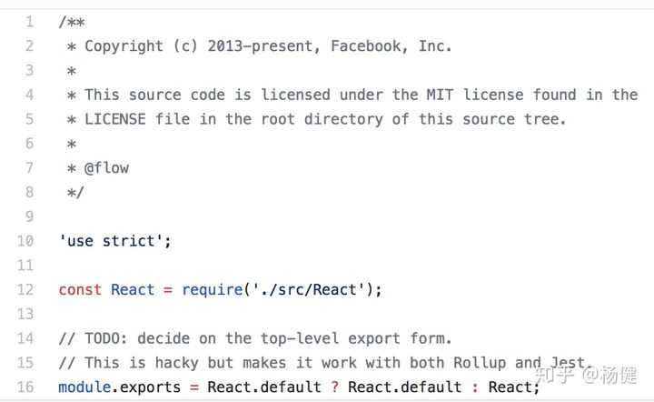

# 深入解析ES Module（一）：禁用export default object
## 不要使用 export default {a, b, c}
一个常见的错误如下

### 错误用法1
```js
# lib.js
export default { 
 a: 1,
 b: 2
}
# main.js
import { a,b } from './lib';
console.log('a:',a);
console.log('b:',b);
```
正确用法1
```js
# lib.js
// 导出方式1
const a =1;
const b = 2;
export {
 a, b
}
// 导出方式2
export const a = 1;
export const b = 2;


#main.js
// 导入方式1
import * as lib from './lib';
console.log(lib.a);
console.log(lib.b);
// 导入方式2
import { a,b} from './lib';
console.log(a);
console.log(b);
```
正确用法2
```js
#lib.js
export default {
a:1,
b:2
}
# main.js
import lib from './lib';
console.log('a:',lib.a);
console.log('b:',lib.b);
const { a, b}  = lib;
console.log('a:',a);
console.log('b:',b);
```
错误用法1这样的写法非常常见，然而该写法是严重的错误，按照esm的标准，a,b的打印结果应该是``undefined,undefined``，但是假如你使用babel5，你会得到打印结果是1，2，这就加剧了人们的认识，认为上述写法不存在任何问题，然而这种写法导致了非常多的问题。

造成这种错误的原因就在于 对象解构(object destruct)的语法和 命名导出(named export)的语法长得一模一样.虽然语法一模一样，但是由于两者使用的上下文不一样，``import {a，b,c } from './xxx'``，这种情况下就是named export,不和import/export一起使用时才是对象解构。

babel 发现了babel5的这个问题，再babel6中已经进行了修复。上述代码在babel6中打印的结果就是undefined,undefined了。然而由于老代码的原因在迁移babel5到babel6的过程中，可以使用babel-plugin-add-module-exports插件，恢复babel5的功能。

既然有插件支持了，我们为什么不能一直用错误用法1呢？这比正确用法的写法简洁很多。原因就是如果要使用插件，就必须要使用babel将esm转换为cjs，这导致后面的打包工具难以对代码进行静态分析了。没有了静态分析，就没法做tree shaking了。更主要的原因一切非标准的写法，不同工具难以保证对齐支持方式一致，这会导致各种交互性问题。


## 正确使用ESM
esm支持两种导入方式和三种导出方式，如下所示
```js
// 导出方式
export default 'hello world'; // default export
export const name = 'yj'; // named export
// 导入方式
import lib from './lib'; // default import
import * as lib from './lib'; // 
import { method1, method2 } from './lib';
```
与之相比 cjs只有一种导入和导出方式,简单很多啊，（为啥esm的module设计的那么复杂呢。。。）
```js
# lib.js 导出
module.exports = {
  a: 1,
  b: 2
}
// 和上面等价，算一种
exports.a = 1;
exports.b = 2;


//main.js 导入
const lib = require('./lib');
console.log('a:',lib.a);
console.log('b:',lib.b);
```
与之相关的还有 dynamic import,dynamic 只有import并且只有一种导入方式
```js
# lib.js
export default{ a:1,b:2}
export const c = 3;
import('./lib').then(module => {
	console.log(module.default.a);
	console.log(module.default.b);
	console.log(module.c);
});
```

这就导致了一个很尴尬的问题，esm和cjs如何交互呢。这分为如下几种情况

1. esm 导入cjs
2. cjs 导入esm
3. dynamic import 导入 esm
4. dynamic import 导入 cjs

随着因为esm的存在多种导入和导出方式，这就导致情况更加复杂。而且不同的平台的处理方式不同，不同工具生成的代码之间又如何处理导入和导出。

这进一步导致了不同平台生成的代码要如何交互,rollup, webpack, babel, typescript,浏览器，node这几种工具要怎么处理cjs和esm的交互性呢。简直一大深坑。

https://github.com/rollup/rollup/issues/1078，

https://github.com/Microsoft/TypeScript/issues/2719

这几个issue深入反映了esm 转换成cjs 的坑。

相关的 stackoverflow讨论 https://stackoverflow.com/questions/39276608/is-there-a-difference-between-export-default-x-and-export-x-as-default/39277065#39277065，

React的实现甚至为了兼容不同打包工具做了相应的hack。

<center style="font-size:14px;color:#C0C0C0;text-decoration:underline">react的hack</center> 

ESM和CJS的互操作的复杂性大部分是来源于 default的导入和导出。

因此tslint特别加了一条规则检验 https://palantir.github.io/tslint/rules/no-default-export/

```
Named imports/exports promote clarity. In addition, current tooling differs on the correct way to handle default imports/exports. Avoiding them all together can help avoid tooling bugs and conflicts.
```
主要的出发点在于不同的工具对于default import/exports的处理有所不同，这导致将不同工具一起使用时可能会产品诡异的bug（简单的例子就是 使用ts-loader处理ts，然后在由babel-loader,然后再由webpack处理）。

如果没有default的导入和导出。esm和cjs 两者的对应关系就简单的多。

## ESM模块加载CJS模块
```js
// lib.js
module.exports = {
 a: 1,
 b: 2
}
// main.js
import { a , b} from './lib';
import * as lib from './lib';
import lib2 from './lib';
console.log(a, b, lib, lib2);
```

webpack4编译后打印结果是 ``" { a:1,b:2} 1 2 \{ a:1, b: 2} "``,证明其等价于
```js
export const a = 1;
export const b = 2;
```
## CJS加载 ES模块
```js
// lib.js

export var a = 1;
export const b = 2;
setTimeout(() => {
  a = 10;
})


setTimeout(() => {a:1});
// main.js
const lib = require('./lib');
console.log(lib,lib.a, lib.b);
setTimeout(() => {
  console.log(lib.a);
},100)
```
webpack4编译后的打印结果是`` { a: [Getter], b: [Getter] } 1 2,10``，这里之所以是Getter，因为esm的named export是live bind，所以lib里a的变化会影响到main.js里导入的lib.a的值。


没有default情况下ESM和CJS的导入和导出关系还是很容易一一对应的。一旦涉及到default的导入导出，就变的比较麻烦了。

## 最佳实践
为了简化ESM和CJS的互操作性，和支持webpack tree shaking，以及老代码的兼容性我们对模块的导入和导出加如下限制。

1. 禁止在前端代码使用commonjs
2. 导出  
对于单class，function，变量、及字面量的导出使用export default ,禁止对复合对象字面量进行导出操作包括数组和对象
```js
// lib1.js
export default 1; // ok
// lib2.js
const a = 1;
// lib3.js
export default 1; // ok
// lib4.js
export default function name() {} // ok
// lib5.js
export default class name {}; // ok
// lib6.js
export default { a: 1, b: 2 } // not ok
```
3. 导入,对于``export default``的导出，使用``import xxx from``,对于``named export``的导出使用``import * as lib from './lib' ``和 ``import “\{ a,b,c}" from './lib'``
```js
import A from './lib1';
import B from './lib2';
import * as lib from './lib6';
import { a, b} from './lib6';
```